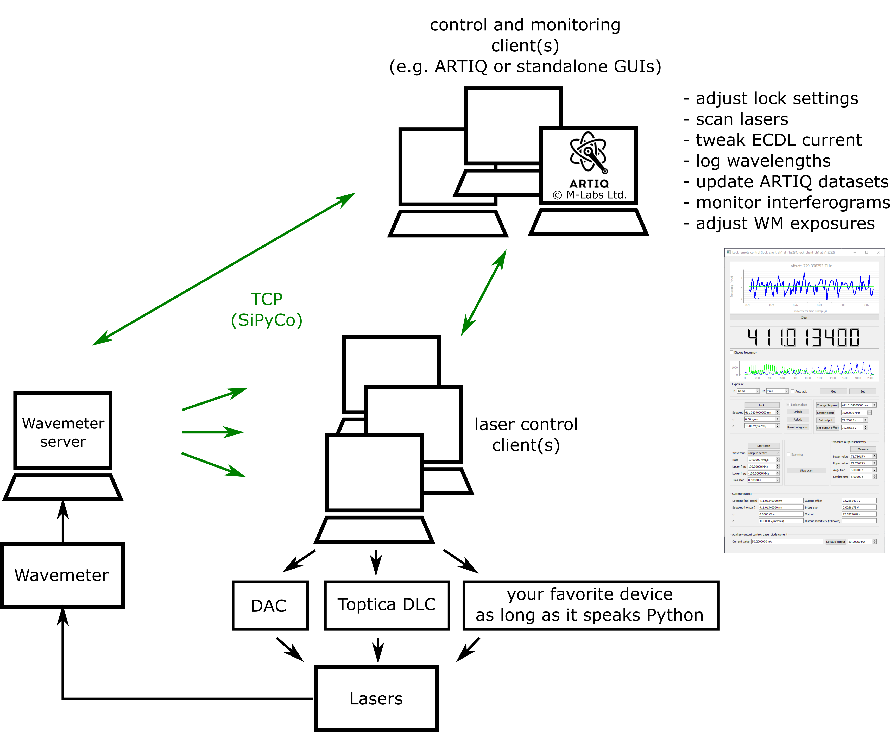
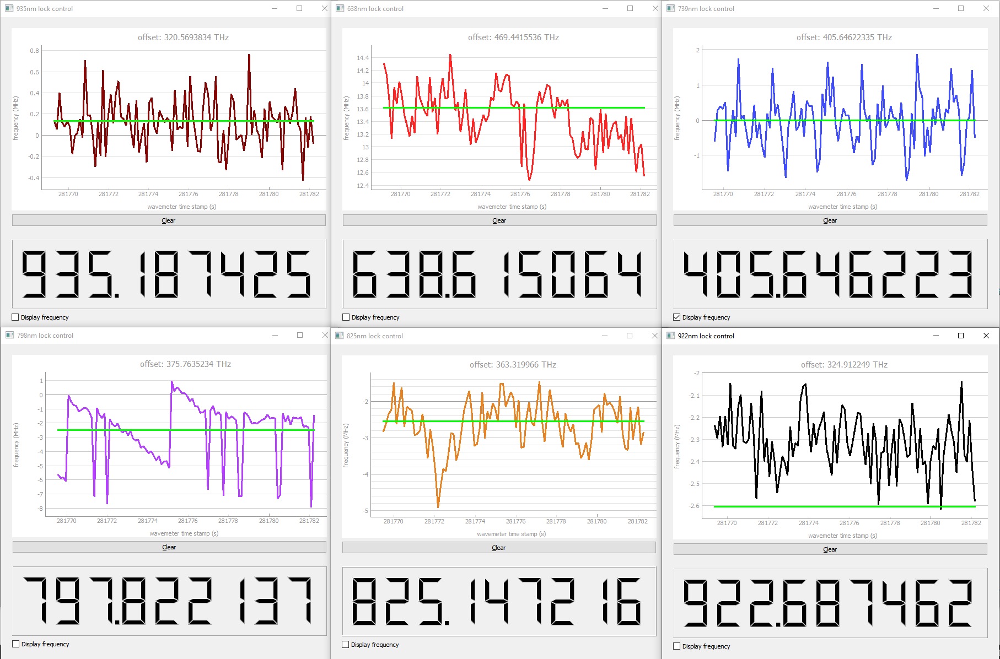
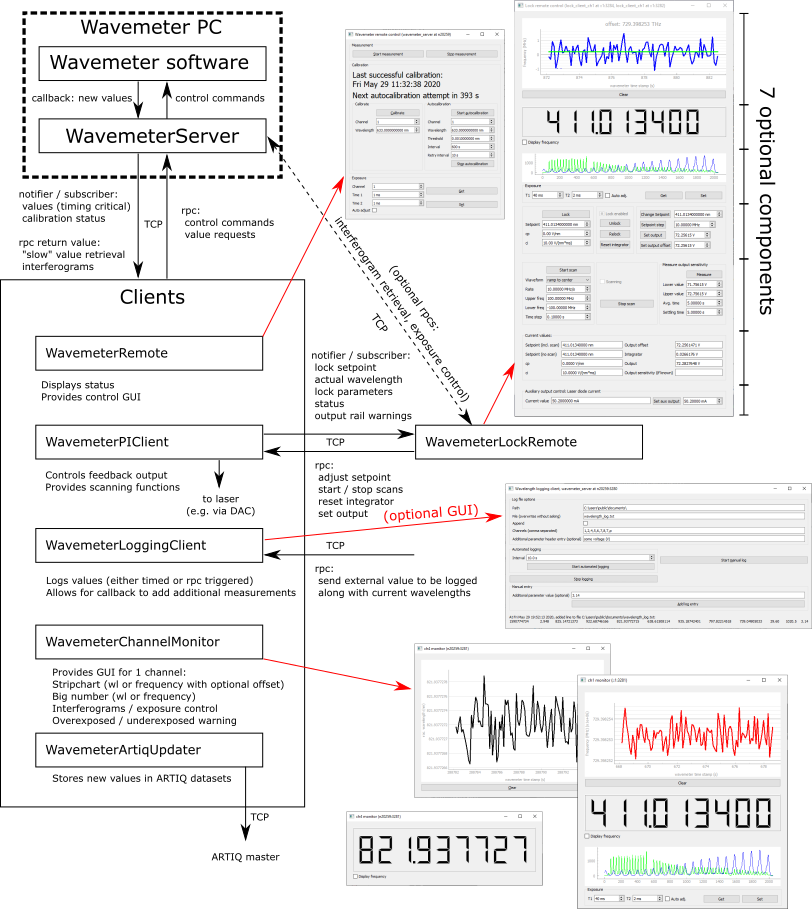
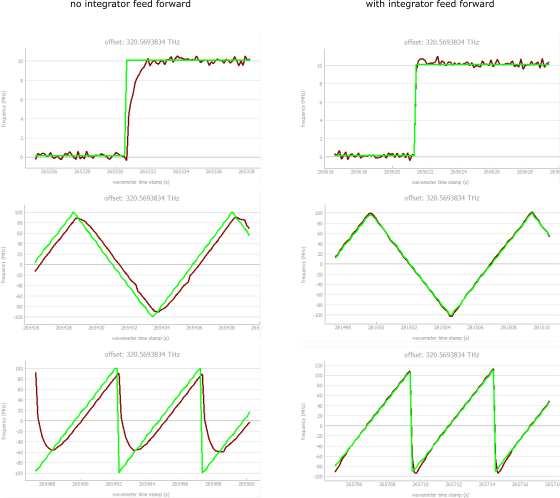

# `hf_wavemeter` package
Tools for remote monitoring and locking lasers to a HighFinesse wavelength meter.

## Summary
These are components to monitor laser wavelengths and lock lasers to the wavemeter. The two main design choices were:

1. **Distributed**: wavemeter readout, laser locking, and monitoring and control components each communicate via TCP (using [SiPyCo](https://github.com/m-labs/sipyco)), making it easy to share resources across different machines - e.g. one running the wavemeter, another controlling the laser(s), and further ones controlling the lock parameters and monitoring lock performance. While standalone GUI components exist for all features, the use of SiPyCo makes integration into [ARTIQ](https://github.com/m-labs/artiq) setups and other Python code straightforward.
2. **Event-driven**: wavelength updates are initiated by the wavemeter software, thus minimizing delays to achieve the highest possible locking bandwidth. Delays on the order of 1ms have been observed in local operation between the server obtaining a value and a client handling it.

**Caution: Please use common sense and the provided output range limiting feature when using the laser locking components of this code. While operation is safe when set up correctly, the authors will not take any responsibility for damaged lasers.**

## Quick start
### Installation
- With `conda`
    1. Install Anaconda3 or Miniconda3 (and configure a proxy in .condarc if necessary).
    2. Edit and run `prepare_conda_environment.py`. Within that file, choose the required packages, depending on whether you want to run the server (i.e. for the computer running the wavemeter software) and whether you need GUI support.
    3. Activate the new environment with `conda activate <env>`.
    4. Install the `hf_wavemeter` package, e.g. by running `pip install .` from the directory containing `setup.py`.
    5. (optional) install the Toptica laser SDK (`pip install toptica_lasersdk`) on the computer which will run the respective lock client.

- With `pip`
    1. Set up required packages with `pip install -r requirements.txt`.
    2. Manually install SiPyCo (https://github.com/m-labs/sipyco).
    3. Install the `hf_wavemeter` package by running `pip install .` from the directory containing `setup.py`.
    4. (optional) install the Toptica laser SDK (`pip install toptica_lasersdk`) on the computer which will run the respective lock client.

### Starting the server
- On the PC connected to the wavemeter: start the server by activating the conda environment and running `wavemeter_server`. For remote access, `--bind` to the correct network interface (or use `--bind *` for all interfaces). Use `--help` for more options (e.g. more than 8 channels, temperature or pressure readout).

### Monitoring a wavelength remotely
- To monitor a channel (or temperature / pressure), start `wavemeter_channel_monitor -s <server> -c <channel>` on the remote end. See `--help` for plenty of customization options.

### Wavemeter remote control
- Use `wavemeter_remote -s <server>` to start a GUI that provides controls to start/stop, calibrate, set up autocalibration, view and change exposure times.

### Logging wavelengths (and/or temperature, pressure)
- Use `wavemeter_logging_client -s <server>` to log wavelengths. Either specify a `--file` from the command line to start logging in the background (see `--help` for configuration options), or omit the `--file` parameter to start a GUI.

### Locking lasers
- Run an appropriate lock client on the computer connected to the laser(s).
- Example lock clients exist for Meilhaus RedLab 31xx DAC cards (`wavemeter_pi_client_redlab`) and Toptica DLC controllers (`wavemeter_pi_client_toptica`). Use `--help` for instructions on how to start them, or see [examples/InYb_laser_locks.py](examples/InYb_laser_locks.py) for an example configuration with 8 locked lasers.
- Writing a locking client for different hardware is simple - see below for instructions.
- Locks can be controlled and monitored remotely using `wavemeter_lock_remote -s <lock computer> --rpc_target <lock name>` (see `--help` for customization options).

#### Writing lock clients for different hardware
Writing a custom lock client (e.g. one which interfaces with lasers using a different DAC model) is straightforward:
- Inherit from `WavemeterPIClient` (see [hf_wavemeter/client.py](hf_wavemeter/client.py)) .
- Override the `_set_output()` method.

See the docstring of the class for more details.

### Interfacing with ARTIQ
There are multiple ways to interface with ARTIQ:
- Communication with the wavemeter server for control and wavelength retrieval: see [examples/wavemeter_artiq_example.py](examples/wavemeter_artiq_example.py)
- Communication with a laser lock for control and monitoring: see [examples/wavemeter_artiq_example.py](examples/wavemeter_artiq_example.py)
- Using `wavemeter_artiq_updater`, which provides live updates of ARTIQ datasets with new wavelength (/temperature/pressure) values
- For logging: by running [WavemeterLoggingClient](hf_wavemeter/logging_client.py) as an RPC target (see python docstring of the class for an example)

### sipyco_rpctool
- Individual commands can be sent via `sipyco_rpctool`; the default ports are `3280` for the wavemeter server and `3284` for laser locks.

### Usage examples
See the batch files in `examples/batches` for some examples. `wavemeter_server` and `examples/InYb_laser_locks.py` are run on the computer controlling both the wavemeter and DACs to lock 8 lasers , and `lock_control_*.bat` run on a remote computer to monitor and control operation of the locks:

## Component Overview

## Component description
### [WavemeterServer](hf_wavemeter/server.py) (command line: `wavemeter_server`)
This runs on the same PC as HighFinesse's software and installs a callback to obtain wavelength updates. By default, it supports 8 channels. To enable more, use the command line option `--nchannels`. Use command line switches `-T` and `-p` to also read out temperature and pressure, respectively.

An autocalibration is also available (different from the autocalibration function in HighFinesse's software). It counts down, checks that a given channel is within some threshold distance of the expected value (e.g. that the laser is locked to the correct mode of a cavity) before stopping the wavelength measurement, performing a calibration, and then restarting the measurement. It can be set up using the `WavemeterRemote` GUI, or via an RPC (e.g. using `sipyco_rpctool`, see `examples/batches/start_autocal.bat`).

All features of the server can be controlled via the provided components detailed below. To directly interact with the server, use `sipyco.sync_struct.Subscriber` for value updates and the SiPyCo RPC machinery for control commands (see docstrings of the class for details).

### [WavemeterClient](hf_wavemeter/client.py)
Base class for clients which receive value updates.

### [WavemeterPIClient](hf_wavemeter/client.py)
Base class for a simple PI controller to lock a laser, plus some scanning functionality. Implementations need to override the `_set_output()` method, e.g. with one that sets the voltage on an analog out channel. Overriding `_output_railing_alert()` allows an action to be taken when the output is (close to) hitting a limit.

When scanning or setpoint changes are used, the performance can be improved by feed forward to the integrator. To enable this feature, either provide an output sensitivity value or use `measure_output_sensitivity()` to determine it. Below are examples of the difference this makes (green is the setpoint, brown the actual laser frequency):

An auxiliary output can be defined for manual remote control of a separate parameter (e.g. the current of an ECDL which is locked via its PZT voltage).

This client provides server functionalities itself in the form of a `sipyco.sync_struct.Notifier` and an RPC target (to be used, e.g. by the GUI component). It will start these servers when run by itself, but if multiple locks are run on the same machine, consider using them as targets of a single server and setting up a single `sipyco.sync_struct.Publisher` for their notifiers. See [examples/InYb_laser_locks.py](examples/InYb_laser_locks.py) for an example.

#### [WavemeterPIClientTopticaEthernetPZT, WavemeterPIClientTopticaEthernetCurrent](hf_wavemeter/pi_client_toptica.py) (command line: `wavemeter_pi_client_toptica`)
Implementations of `WavemeterPIClient` using the Toptica SDK to control a Toptica DLC controller via ethernet. The first uses the PZT voltage for locking and provides access to the laser diode current via its aux output, whereas the second locks via the current.

**Please use responsibly and ensure appropriate current limits to prevent damage to the laser.**

#### [WavemeterPIClientRedLab, WavemeterPIClientRedLabPlusAuxOut](hf_wavemeter/pi_client_redlab.py) (command line: `wavemeter_pi_client_redlab`)
Implementation of `WavemeterPIClient` using a Meilhaus RedLab 31xx analog out device. The second version uses a second analog out channel as its auxiliary output.

### [WavemeterLockRemote](hf_wavemeter/lock_remote.py) (command line: `wavemeter_lock_remote`)
Provides a GUI to monitor and control a `WavemeterPIClient`. Opens two connections, for `RPC` (default port 3284) and Publisher/Subscriber (default port 3282). If the RPC target and notifier have the same name, only the former needs to be specified (via `--rpc_target`). Use `--aux` to enable aux output control. The rest of the GUI is also highly customizable via command line options (see `--help`).

### [WavemeterChannelMonitor](hf_wavemeter/channel_monitor.py) (command line: `wavemeter_channel_monitor`)
Provides a stripchart and / or scaleable LCD number of wavelength or frequency of a channel. Can also read out and display the interferograms for every nth value. Lots of customization command line options (see `--help`).

### [WavemeterArtiqUpdater](hf_wavemeter/artiq_updater.py) (command line: `wavemeter_artiq_updater`)
Connects to an ARTIQ master to update its datasets with values obtained from the wavemeter server via its publisher.

### [WavemeterLoggingClient](hf_wavemeter/logging_client.py) (command line: `wavemeter_logging_client`)
Logs a set of channels (and / or temperature, pressure) to a file. Logging can either be timed or triggered via an RPC (allowing the addition of external values to the log file), or a combination of both. When started with the `--file` option specified, a log is started immediately, whereas omitting this option opens a GUI.

### [WavemeterRemote](hf_wavemeter/remote.py) (command line: `wavemeter_remote`)
Connects to the wavemeter server RPC target and its calibration status publisher. Displays the latest calibration timestamp and autocalibration countdown and allows starting / stopping the measurement, calibration control as well as retrieval / setting of exposure times.

## Misc information

### Note on single-channel operation
The update rate of the wavemeter might be too fast for some of the components when only a single channel is read out with a low exposure time. In particular:
- The update rate for remotely displayed interferograms might need to be reduced (an option exists to limit the updates to every `n`th measurement).
- Locking hardware might not be able to keep up, requiring modification of the respective locking client functions.

### Dependencies

- General:
  - python (tested with 3.8.3)
  - sipyco (tested with 1.1)
- Server: 
  - janus (tested with 0.6.1)
- GUI components:
  - numpy (tested with 1.18.4)
  - pyqt (tested with 5.12.3)
  - asyncqt (tested with 0.8.0)
  - pyqtgraph (tested with 0.11.0rc0)

## Contributors
- Jonas Keller
- Daqing Wang
- Jan Kiethe
- Henning A. Fürst

## Acknowledgement

Part of this work is developed as part of the Joint Research Project [18SIB05 ROCIT](http://empir.npl.co.uk/rocit/) of the European Metrology Programme for Innovation and Research (EMPIR).

## Disclaimer

This software is developed at Leibniz Universität Hannover (LUH). The software is made available "as is" free of cost. LUH assumes no responsibility whatsoever for its use by other parties, and makes no guarantees, expressed or implied, about its quality, reliability, safety, suitability or any other characteristic. In no event will LUH be liable for any direct, indirect or consequential damage arising in connection with the use of this software. Identification of commercial components does not imply a recommendation or endorsement by LUH.

Names or designations of products, manufacturers and origins used herein are intended only to illustrate compatibility and examples of use. This applies in particular to trademarks, brand and product names. They are the property of their rightful owners. Such use by LUH is of merely descriptive nature and does not constitute an advertisement, endorsement or special emphasis on the characteristics of the products or manufacturers mentioned. No representation or guarantee is made towards the usability of this software with the products mentioned, or similar. Insofar, no liability is assumed.
## License

This software is distributed under the LGPLv3 license.